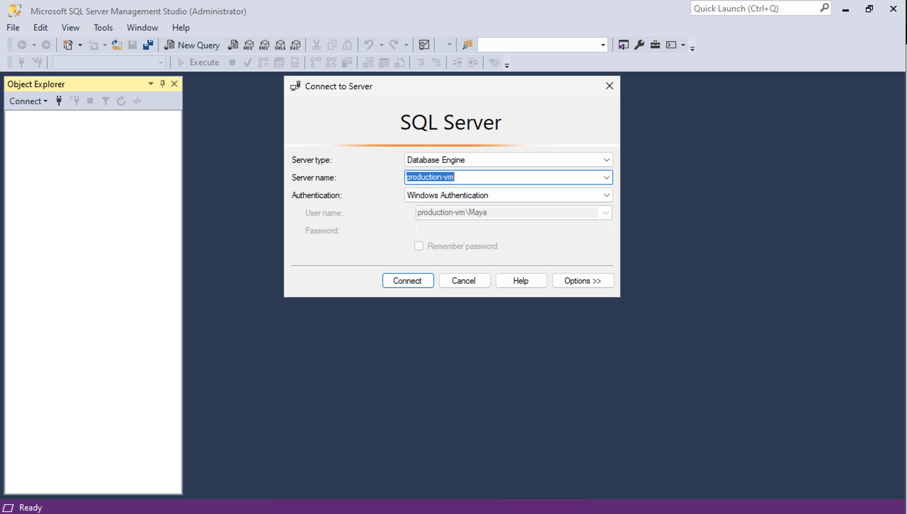
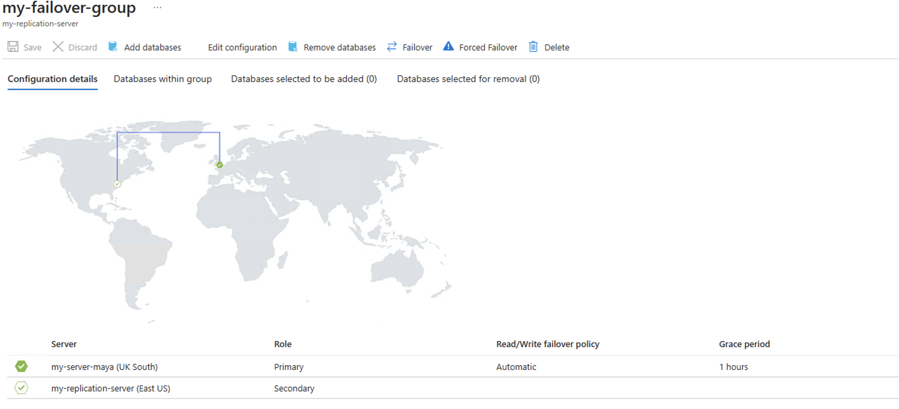

# Azure Database Migration Project

## Introduction
In this project, I implemented a cloud-based database system on Microsoft Azure, transitioning an on-premise database to the Azure SQL Database. K

- **Established a production environment:** Set up a SQL server database on an Azure VM.
- **Database Migration:** Migrated the database to Azure SQL Database, ensuring data backup and automated scheduling.
- **Backup:**Used SQL Server Management Studio to set a connection to Azure, schedule weekly backups, and store them in the cloud. 
- **Disaster recovery**: Simulated a disaster recovery scenario with data loss and data restoration from backups.
- **Geo-replication and Failover configuration:** Set up geo-replication and failover configuration and testing to ensure data availability.
- **Security Integration:** Used Microsoft Entra ID integration for defining access roles, adding an extra layer of control and protection to the database environment.

### Final Architecture:
A visual representation of the setup, migration, disaster recovery, geo-replication, failover, and security configurations.

  

### Technologies Used:
- **Microsoft Azure**: Central platform for hosting and managing cloud-based database services.
- **Azure SQL Database**: Cloud-based relational database service for data storage and management.
- **Azure Data Studio**: A versatile tool for managing SQL Server, including Azure SQL Database and SQL Data Warehouse.
- **SQL Server Management Studio (SSMS)**: Integrated environment for SQL infrastructure management.
- **Microsoft Entra ID**: Identity and access management service for secure authentication.
- **Azure Blob Storage**:  Online storage service for data backup and recovery.
- **Windows Virtual Machine**: Used for creating production and development environments.

## Table of contents 
1. [Setting up the Production Environment](#Setting-up-the-Production-Environment)
2. [Database Migration to Azure SQL Database](#Database-Migration-to-Azure-SQL-Database)
3. [Data Backup and Development Environment](#Data-Backup-and-Development-Environment)
4. [Disaster Recovery Simulation](#Disaster-Recovery-Simulation)
5. [Geo-replication and Failover configuration ](#Geo-replication-and-Failover-configuration )
6. [Security & Access Control](#Security-&-Access-Control)

## Setting up the Production Environment 

- Azure VM and Firewall Setup:
  - Created an Azure Virtual Machine (Windows 11).
  - Configured appropriate firewall rules for remote connections via the RDP protocol.
  - Established a remote connection using the RDP protocol and Microsoft Remote Desktop.
  
- Installed SQL Server and SSMS on the VM.

- Connected to SQL Server via SSMS.

- Used SSMS to restore a database from a .bak backup file, ensuring the production environment mirrors the on-premise server's functionality.

## Database Migration to Azure SQL Database
- Used Data Studio, SQL Server schema compare & Azure SQL Migration to migrate the on-premises database to Azure.

- Set-up: 
  - Created a new SQL Database Server using SQL authentication. 
  - Created a SQL database and configured firewall rules to ensure secure VM access to the SQL database. This will serve as the target for migration of the on premise database.

- Azure Data Studio:
  - Established Azure Data Studio connection to both local and Azure SQL Servers.
  

  

  
- Schema migration:
  - Used SQL Server Schema Compare extension in Azure Data Studio to compare and align schemas between the Local SQL Server (source) and Azure SQL Database (target).

- Data migration:
  - Used Azure SQL Migration extension in Azure Data Studio to initiate, configure, and facilitate the migration process.
  - Set up an Azure Database Migration Service for managing the migration process.
  - Installed and configured Integration Runtime to allow connection to the Azure Database Migration Service.
  - To confirm the success of the database migration process, carrIED out a comprehensive validation. Thoroughly inspectED the data, schema, and any configurations of the migrated database, ensuring that the migration haD been executed successfully and adhereD to principles of data integrity.

## Data Backup and Development Environment
- Provisioned a development environment and development database and created an automation solution for the development environment

- Back-up the on premise database:
  - Generated a full back-up of the production database 
  - Created a storage account and container to keep the back-up.
  - Uploaded and stored the back-up to Azure Blob storage

- Restored the database on the Development Environment:
  - Provisioned a new Development VM and Development Environment that mirrors the Production Environment (installation of SQL server and SSMS). This environment was created for hosting the development database.
  - Restored the database back-up into the new Development Environment.
  - Utilised SSMS to establish a Management Task and automated regular back-ups of the development database. This ensured consistent protection of the database and simplified recovery of the database if required. 
  - Tested the newly established maintenance plan by executing.

  

## Disaster Recovery Simulation
- Intentionally caused data loss in the production environment to ensure functioning recovery procedures.

- Deliberately removed, using SQL statements, critical data fom the production database to replicate a scenario of compromised data integrity using the already established connection in Azure Data Studio.

- Used Azure SQL Database Backup to restore the production database to a restoration point just before the simulated data loss. Validated the restoration success by examining the data through the connection in Azure Data Studio.

## Geo-replication and Failover configuration 
- Configured geo-replication by establishing a synchronized copy of the production database in a secondary region. Conducted to enhance data protection, ensure continuous data availability and minimize potential downtime during unforeseen disruptions.  Performed failover testing to ensure the availability and consistency of the secondary database.

- Set up geo-replication of the production database. The created replica of the primary database resided on a separate SQL server located in a different geographical region from the primary database server.

- Orchestrated a planned failover to the secondary region followed by a failover back to the primary region.

  

## Security & Access Control

- Integrated Microsoft Entra ID authentication for the SQL Server (hosting the production database) to strengthen database security.

- Set up and assigned a Microsoft Entra admin role. 

- Created a new user account with database read-only privileges by assigning this user the db_datareader role